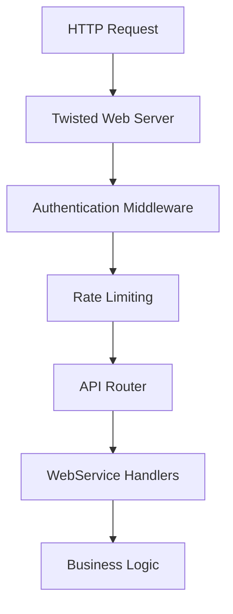

# Detailed Implementation Plan for Scrapyd Improvements

## Branch 1: feature/google-cloud-run-deployment
### Google Cloud Run Gen2 Serverless Deployment

#### Week 1-2: Cloud Run Optimized Dockerfile
**Files to create/modify:**
- `Dockerfile` (replace existing - Cloud Run optimized)
- `Dockerfile.dev` (new - development version)
- `.dockerignore` (new)
- `cloudrun.yaml` (Cloud Run service configuration)

**Implementation tasks:**
1. **Cloud Run Gen2 Optimized Dockerfile**
   ```dockerfile
   # Stage 1: Builder
   FROM python:3.12-slim as builder
   WORKDIR /build
   COPY pyproject.toml README.rst MANIFEST.in ./
   COPY scrapyd/ ./scrapyd/
   RUN pip install --no-cache-dir build && \
       python -m build --wheel

   # Stage 2: Cloud Run Runtime
   FROM python:3.12-slim

   # Install system dependencies needed for Cloud Run
   RUN apt-get update && \
       apt-get install -y --no-install-recommends \
       curl \
       ca-certificates \
       && apt-get clean \
       && rm -rf /var/lib/apt/lists/*

   # Create non-root user for security
   RUN groupadd -r scrapyd && useradd -r -g scrapyd scrapyd

   WORKDIR /app
   COPY --from=builder /build/dist/*.whl /tmp/
   RUN pip install --no-cache-dir /tmp/*.whl && rm /tmp/*.whl

   # Create Cloud Storage mounted directories
   RUN mkdir -p /mnt/gcs/{eggs,logs,items} && \
       mkdir -p /tmp/scrapyd && \
       chown -R scrapyd:scrapyd /mnt/gcs /tmp/scrapyd

   # Cloud Run specific configuration
   ENV PORT=8080
   ENV SCRAPYD_BIND_ADDRESS=0.0.0.0
   ENV SCRAPYD_HTTP_PORT=8080
   ENV SCRAPYD_EGG_DIR=/mnt/gcs/eggs
   ENV SCRAPYD_LOGS_DIR=/mnt/gcs/logs
   ENV SCRAPYD_ITEMS_DIR=/mnt/gcs/items
   ENV SCRAPYD_DBS_DIR=/tmp/scrapyd

   USER scrapyd
   EXPOSE 8080

   # Cloud Run health check endpoint
   HEALTHCHECK --interval=30s --timeout=3s --start-period=10s --retries=3 \
     CMD curl -f http://localhost:8080/daemonstatus.json || exit 1

   # Use exec form for proper signal handling in Cloud Run
   CMD ["python", "-m", "scrapyd.cloudrun"]
   ```

2. **Cloud Run Service Configuration**
   ```yaml
   # cloudrun.yaml
   apiVersion: serving.knative.dev/v1
   kind: Service
   metadata:
     name: scrapyd-service
     annotations:
       run.googleapis.com/execution-environment: gen2
       run.googleapis.com/cpu-throttling: "false"
   spec:
     template:
       metadata:
         annotations:
           # Cloud Run Gen2 annotations
           run.googleapis.com/execution-environment: gen2
           run.googleapis.com/cpu-throttling: "false"
           # Increase timeout for long-running spiders
           run.googleapis.com/timeout: "3600"
           # Enable HTTP/2
           run.googleapis.com/http2: "true"
           # VPC connector for private resources
           run.googleapis.com/vpc-access-connector: scrapyd-connector
           run.googleapis.com/vpc-access-egress: private-ranges-only
       spec:
         # Allow up to 1000 concurrent requests per instance
         containerConcurrency: 1000
         # Timeout for requests
         timeoutSeconds: 3600
         containers:
         - image: gcr.io/PROJECT_ID/scrapyd:latest
           ports:
           - containerPort: 8080
           env:
           - name: SCRAPYD_MAX_PROC
             value: "10"
           - name: GOOGLE_CLOUD_PROJECT
             value: "PROJECT_ID"
           - name: GCS_BUCKET
             value: "scrapyd-data-bucket"
           # Resource allocation
           resources:
             limits:
               cpu: "4"
               memory: "8Gi"
             requests:
               cpu: "1"
               memory: "2Gi"
           # Volume mounts for Cloud Storage
           volumeMounts:
           - name: gcs-volume
             mountPath: /mnt/gcs
         volumes:
         - name: gcs-volume
           csi:
             driver: gcsfuse.csi.storage.gke.io
             volumeAttributes:
               bucketName: scrapyd-data-bucket
               mountOptions: "implicit-dirs"
         # Scale to zero when not in use
         scaling:
           minScale: 0
           maxScale: 100
   ```

3. **Cloud Run specific adapter**
   ```python
   # scrapyd/cloudrun.py
   import os
   import signal
   import sys
   from scrapyd.app import application
   from scrapyd.config import Config
   from twisted.internet import reactor
   from twisted.web import server
   from google.cloud import storage
   from google.cloud import secretmanager
   import logging

   class CloudRunScrapyd:
       def __init__(self):
           self.setup_logging()
           self.setup_gcs()
           self.setup_config()

       def setup_logging(self):
           """Configure logging for Cloud Run"""
           logging.basicConfig(
               level=logging.INFO,
               format='{"severity": "%(levelname)s", "message": "%(message)s", "timestamp": "%(asctime)s"}',
               stream=sys.stdout
           )

       def setup_gcs(self):
           """Initialize Google Cloud Storage"""
           project_id = os.getenv('GOOGLE_CLOUD_PROJECT')
           bucket_name = os.getenv('GCS_BUCKET')

           if project_id and bucket_name:
               self.storage_client = storage.Client(project=project_id)
               self.bucket = self.storage_client.bucket(bucket_name)

       def setup_config(self):
           """Setup Cloud Run specific configuration"""
           config_dict = {
               'bind_address': '0.0.0.0',
               'http_port': int(os.getenv('PORT', '8080')),
               'max_proc': int(os.getenv('SCRAPYD_MAX_PROC', '10')),
               'eggs_dir': '/mnt/gcs/eggs',
               'logs_dir': '/mnt/gcs/logs',
               'items_dir': '/mnt/gcs/items',
               'dbs_dir': '/tmp/scrapyd',
               # Cloud Run specific settings
               'poll_interval': 5.0,
               'runner': 'scrapyd.runner',
               'application': 'scrapyd.app.application',
               'webroot': 'scrapyd.website.Root'
           }

           self.config = Config(config_dict)

       def handle_signal(self, signum, frame):
           """Handle termination signals gracefully"""
           logging.info(f"Received signal {signum}, shutting down gracefully")
           reactor.stop()

       def run(self):
           """Run Scrapyd on Cloud Run"""
           # Register signal handlers for graceful shutdown
           signal.signal(signal.SIGTERM, self.handle_signal)
           signal.signal(signal.SIGINT, self.handle_signal)

           # Create Twisted application
           app = application(self.config)

           # Start the reactor
           logging.info("Starting Scrapyd on Cloud Run Gen2")
           reactor.run()

   if __name__ == '__main__':
       cloud_run_scrapyd = CloudRunScrapyd()
       cloud_run_scrapyd.run()
   ```

#### Week 3: Google Cloud Integration
**Files to create:**
- `terraform/main.tf` (Infrastructure as Code)
- `terraform/variables.tf`
- `terraform/outputs.tf`
- `scripts/deploy-cloudrun.sh` (enhanced)
- `gcp/cloud-build.yaml`

**Implementation:**
```hcl
# terraform/main.tf
terraform {
  required_providers {
    google = {
      source  = "hashicorp/google"
      version = "~> 4.0"
    }
  }
}

provider "google" {
  project = var.project_id
  region  = var.region
}

# Enable required APIs
resource "google_project_service" "required_apis" {
  for_each = toset([
    "run.googleapis.com",
    "cloudbuild.googleapis.com",
    "secretmanager.googleapis.com",
    "storage.googleapis.com",
    "vpcaccess.googleapis.com"
  ])

  service = each.value
  disable_on_destroy = false
}

# Cloud Storage bucket for persistent data
resource "google_storage_bucket" "scrapyd_data" {
  name     = "${var.project_id}-scrapyd-data"
  location = var.region

  uniform_bucket_level_access = true

  versioning {
    enabled = true
  }

  lifecycle_rule {
    condition {
      age = 90
    }
    action {
      type = "Delete"
    }
  }
}

# VPC Connector for private networking
resource "google_vpc_access_connector" "scrapyd_connector" {
  name          = "scrapyd-connector"
  region        = var.region
  ip_cidr_range = "10.8.0.0/28"
  network       = "default"

  min_instances = 2
  max_instances = 10
}

# Cloud Run service
resource "google_cloud_run_service" "scrapyd" {
  name     = "scrapyd-service"
  location = var.region

  depends_on = [google_project_service.required_apis]

  template {
    metadata {
      annotations = {
        "run.googleapis.com/execution-environment" = "gen2"
        "run.googleapis.com/cpu-throttling"        = "false"
        "run.googleapis.com/vpc-access-connector"  = google_vpc_access_connector.scrapyd_connector.name
        "run.googleapis.com/vpc-access-egress"     = "private-ranges-only"
      }
    }

    spec {
      container_concurrency = 1000
      timeout_seconds      = 3600

      containers {
        image = "gcr.io/${var.project_id}/scrapyd:latest"

        ports {
          container_port = 8080
        }

        env {
          name  = "GOOGLE_CLOUD_PROJECT"
          value = var.project_id
        }

        env {
          name  = "GCS_BUCKET"
          value = google_storage_bucket.scrapyd_data.name
        }

        env {
          name  = "SCRAPYD_MAX_PROC"
          value = var.max_concurrent_spiders
        }

        resources {
          limits = {
            cpu    = "4"
            memory = "8Gi"
          }
          requests = {
            cpu    = "1"
            memory = "2Gi"
          }
        }

        volume_mounts {
          name       = "gcs-volume"
          mount_path = "/mnt/gcs"
        }
      }

      volumes {
        name = "gcs-volume"

        csi {
          driver = "gcsfuse.csi.storage.gke.io"
          volume_attributes = {
            bucketName    = google_storage_bucket.scrapyd_data.name
            mountOptions  = "implicit-dirs"
          }
        }
      }
    }
  }

  autogenerate_revision_name = true
}

# IAM binding for Cloud Run
resource "google_cloud_run_service_iam_binding" "scrapyd_invoker" {
  location = google_cloud_run_service.scrapyd.location
  project  = google_cloud_run_service.scrapyd.project
  service  = google_cloud_run_service.scrapyd.name
  role     = "roles/run.invoker"

  members = [
    "allUsers",  # Make it publicly accessible - adjust as needed
  ]
}

# Cloud Build trigger for automatic deployment
resource "google_cloudbuild_trigger" "scrapyd_deploy" {
  name = "scrapyd-deploy-trigger"

  github {
    owner = var.github_owner
    name  = var.github_repo
    push {
      branch = "^main$"
    }
  }

  build {
    step {
      name = "gcr.io/cloud-builders/docker"
      args = ["build", "-t", "gcr.io/${var.project_id}/scrapyd:$COMMIT_SHA", "."]
    }

    step {
      name = "gcr.io/cloud-builders/docker"
      args = ["push", "gcr.io/${var.project_id}/scrapyd:$COMMIT_SHA"]
    }

    step {
      name = "gcr.io/google.com/cloudsdktool/cloud-sdk"
      entrypoint = "gcloud"
      args = [
        "run", "deploy", "scrapyd-service",
        "--image", "gcr.io/${var.project_id}/scrapyd:$COMMIT_SHA",
        "--region", var.region,
        "--platform", "managed"
      ]
    }
  }
}
```

```bash
# scripts/deploy-cloudrun.sh (enhanced)
#!/bin/bash
set -euo pipefail

# Configuration
PROJECT_ID=${GOOGLE_CLOUD_PROJECT:-""}
REGION=${REGION:-"us-central1"}
SERVICE_NAME="scrapyd-service"
IMAGE_NAME="gcr.io/${PROJECT_ID}/scrapyd"

# Colors for output
RED='\033[0;31m'
GREEN='\033[0;32m'
YELLOW='\033[1;33m'
NC='\033[0m' # No Color

log() {
    echo -e "${GREEN}[INFO]${NC} $1"
}

warn() {
    echo -e "${YELLOW}[WARN]${NC} $1"
}

error() {
    echo -e "${RED}[ERROR]${NC} $1"
    exit 1
}

# Check prerequisites
check_prerequisites() {
    log "Checking prerequisites..."

    if [ -z "$PROJECT_ID" ]; then
        error "GOOGLE_CLOUD_PROJECT environment variable is not set"
    fi

    if ! command -v gcloud &> /dev/null; then
        error "gcloud CLI is not installed"
    fi

    if ! command -v docker &> /dev/null; then
        error "docker is not installed"
    fi

    # Check if authenticated
    if ! gcloud auth list --filter=status:ACTIVE --format="value(account)" | grep -q .; then
        error "Not authenticated with gcloud. Run: gcloud auth login"
    fi

    log "Prerequisites check passed"
}

# Enable required APIs
enable_apis() {
    log "Enabling required Google Cloud APIs..."

    gcloud services enable \
        run.googleapis.com \
        cloudbuild.googleapis.com \
        secretmanager.googleapis.com \
        storage.googleapis.com \
        vpcaccess.googleapis.com \
        --project=$PROJECT_ID

    log "APIs enabled successfully"
}

# Build and push Docker image
build_and_push() {
    log "Building Docker image..."

    # Get git commit hash for tagging
    GIT_SHA=$(git rev-parse --short HEAD)
    TAG="latest"

    if [ -n "$GIT_SHA" ]; then
        TAG="$GIT_SHA"
    fi

    # Build the image
    docker build -t "$IMAGE_NAME:$TAG" .
    docker tag "$IMAGE_NAME:$TAG" "$IMAGE_NAME:latest"

    log "Pushing image to Container Registry..."

    # Configure Docker for GCR
    gcloud auth configure-docker --quiet

    # Push both tags
    docker push "$IMAGE_NAME:$TAG"
    docker push "$IMAGE_NAME:latest"

    log "Image pushed successfully: $IMAGE_NAME:$TAG"
}

# Create Cloud Storage bucket
create_storage() {
    BUCKET_NAME="${PROJECT_ID}-scrapyd-data"

    log "Creating Cloud Storage bucket: $BUCKET_NAME..."

    if gsutil ls "gs://$BUCKET_NAME" &> /dev/null; then
        warn "Bucket $BUCKET_NAME already exists"
    else
        gsutil mb -p $PROJECT_ID -c STANDARD -l $REGION "gs://$BUCKET_NAME"
        log "Bucket created successfully"
    fi

    # Set proper permissions
    gsutil iam ch serviceAccount:$(gcloud projects describe $PROJECT_ID --format="value(projectNumber)")-compute@developer.gserviceaccount.com:objectAdmin "gs://$BUCKET_NAME"
}

# Deploy to Cloud Run
deploy_cloudrun() {
    log "Deploying to Cloud Run..."

    gcloud run deploy $SERVICE_NAME \
        --image="$IMAGE_NAME:latest" \
        --platform=managed \
        --region=$REGION \
        --allow-unauthenticated \
        --execution-environment=gen2 \
        --cpu=4 \
        --memory=8Gi \
        --concurrency=1000 \
        --timeout=3600 \
        --min-instances=0 \
        --max-instances=100 \
        --set-env-vars="GOOGLE_CLOUD_PROJECT=$PROJECT_ID,GCS_BUCKET=${PROJECT_ID}-scrapyd-data,SCRAPYD_MAX_PROC=10" \
        --project=$PROJECT_ID

    # Get the service URL
    SERVICE_URL=$(gcloud run services describe $SERVICE_NAME --region=$REGION --format="value(status.url)")

    log "Deployment completed successfully!"
    log "Service URL: $SERVICE_URL"
    log "Health check: $SERVICE_URL/daemonstatus.json"
}

# Main execution
main() {
    log "Starting Cloud Run deployment for Scrapyd..."

    check_prerequisites
    enable_apis
    build_and_push
    create_storage
    deploy_cloudrun

    log "Deployment pipeline completed successfully!"
}

# Run main function
main "$@"
```

#### Week 4: Monitoring & Auto-scaling
**Files to create/modify:**
- `monitoring/cloudrun-dashboard.json`
- `terraform/monitoring.tf`
- `scripts/setup-monitoring.sh`

**Implementation:**
```hcl
# terraform/monitoring.tf
# Cloud Monitoring dashboard
resource "google_monitoring_dashboard" "scrapyd_dashboard" {
  dashboard_json = file("${path.module}/../monitoring/cloudrun-dashboard.json")
}

# Alerting policies
resource "google_monitoring_alert_policy" "high_error_rate" {
  display_name = "Scrapyd High Error Rate"
  combiner     = "OR"

  conditions {
    display_name = "Error rate > 5%"

    condition_threshold {
      filter          = "resource.type=\"cloud_run_revision\" AND resource.labels.service_name=\"scrapyd-service\""
      duration        = "300s"
      comparison      = "COMPARISON_GT"
      threshold_value = 0.05

      aggregations {
        alignment_period   = "60s"
        per_series_aligner = "ALIGN_RATE"
      }
    }
  }

  notification_channels = [google_monitoring_notification_channel.email.name]
}

resource "google_monitoring_alert_policy" "high_memory_usage" {
  display_name = "Scrapyd High Memory Usage"
  combiner     = "OR"

  conditions {
    display_name = "Memory usage > 80%"

    condition_threshold {
      filter          = "resource.type=\"cloud_run_revision\" AND resource.labels.service_name=\"scrapyd-service\""
      duration        = "300s"
      comparison      = "COMPARISON_GT"
      threshold_value = 0.8

      aggregations {
        alignment_period   = "60s"
        per_series_aligner = "ALIGN_MEAN"
      }
    }
  }

  notification_channels = [google_monitoring_notification_channel.email.name]
}

# Notification channel
resource "google_monitoring_notification_channel" "email" {
  display_name = "Scrapyd Email Notifications"
  type         = "email"

  labels = {
    email_address = var.alert_email
  }
}
```

```json
// monitoring/cloudrun-dashboard.json
{
  "displayName": "Scrapyd Cloud Run Dashboard",
  "mosaicLayout": {
    "tiles": [
      {
        "width": 6,
        "height": 4,
        "widget": {
          "title": "Request Count",
          "xyChart": {
            "dataSets": [
              {
                "timeSeriesQuery": {
                  "timeSeriesFilter": {
                    "filter": "resource.type=\"cloud_run_revision\" AND resource.labels.service_name=\"scrapyd-service\"",
                    "aggregation": {
                      "alignmentPeriod": "60s",
                      "perSeriesAligner": "ALIGN_RATE",
                      "crossSeriesReducer": "REDUCE_SUM"
                    }
                  }
                },
                "plotType": "LINE"
              }
            ]
          }
        }
      },
      {
        "width": 6,
        "height": 4,
        "xPos": 6,
        "widget": {
          "title": "Response Latency",
          "xyChart": {
            "dataSets": [
              {
                "timeSeriesQuery": {
                  "timeSeriesFilter": {
                    "filter": "resource.type=\"cloud_run_revision\" AND resource.labels.service_name=\"scrapyd-service\"",
                    "aggregation": {
                      "alignmentPeriod": "60s",
                      "perSeriesAligner": "ALIGN_DELTA",
                      "crossSeriesReducer": "REDUCE_PERCENTILE_95"
                    }
                  }
                },
                "plotType": "LINE"
              }
            ]
          }
        }
      },
      {
        "width": 6,
        "height": 4,
        "yPos": 4,
        "widget": {
          "title": "Active Instances",
          "xyChart": {
            "dataSets": [
              {
                "timeSeriesQuery": {
                  "timeSeriesFilter": {
                    "filter": "resource.type=\"cloud_run_revision\" AND resource.labels.service_name=\"scrapyd-service\"",
                    "aggregation": {
                      "alignmentPeriod": "60s",
                      "perSeriesAligner": "ALIGN_MEAN",
                      "crossSeriesReducer": "REDUCE_SUM"
                    }
                  }
                },
                "plotType": "STACKED_AREA"
              }
            ]
          }
        }
      },
      {
        "width": 6,
        "height": 4,
        "xPos": 6,
        "yPos": 4,
        "widget": {
          "title": "Memory Utilization",
          "xyChart": {
            "dataSets": [
              {
                "timeSeriesQuery": {
                  "timeSeriesFilter": {
                    "filter": "resource.type=\"cloud_run_revision\" AND resource.labels.service_name=\"scrapyd-service\"",
                    "aggregation": {
                      "alignmentPeriod": "60s",
                      "perSeriesAligner": "ALIGN_MEAN",
                      "crossSeriesReducer": "REDUCE_MEAN"
                    }
                  }
                },
                "plotType": "LINE"
              }
            ]
          }
        }
      }
    ]
  }
}
```

**Testing checklist:**
- [ ] Container deploys to Cloud Run Gen2 successfully
- [ ] Service scales to zero when idle
- [ ] Auto-scaling works under load
- [ ] Cloud Storage integration works
- [ ] Health checks pass
- [ ] Monitoring dashboard shows metrics
- [ ] Alerts trigger correctly
- [ ] Terraform deployment works
- [ ] CI/CD pipeline deploys automatically

---

## Branch 2: feature/api-modernization
### API Modernization & WebSocket Support

#### Week 1-2: RESTful API v2 Design
**Files to create:**
- `scrapyd/api/__init__.py`
- `scrapyd/api/v2/__init__.py`
- `scrapyd/api/v2/projects.py`
- `scrapyd/api/v2/spiders.py`
- `scrapyd/api/v2/jobs.py`
- `scrapyd/api/v2/auth.py`
- `scrapyd/api/schemas.py`

**Implementation tasks:**
1. **API Schema Definition**
   ```python
   # scrapyd/api/schemas.py
   from dataclasses import dataclass
   from typing import Dict, List, Optional
   from datetime import datetime

   @dataclass
   class ProjectSchema:
       name: str
       version: str
       spiders: List[str]
       created_at: datetime
       updated_at: datetime

   @dataclass
   class SpiderSchema:
       name: str
       project: str
       version: str
       arguments: Dict[str, str]
       settings: Dict[str, str]

   @dataclass
   class JobSchema:
       id: str
       project: str
       spider: str
       status: str  # pending, running, finished, cancelled
       start_time: Optional[datetime]
       end_time: Optional[datetime]
       log_url: str
       items_url: Optional[str]
   ```

2. **RESTful Endpoints**
   ```python
   # scrapyd/api/v2/projects.py
   from twisted.web import resource
   import json

   class ProjectsResource(resource.Resource):
       def render_GET(self, request):
           """GET /api/v2/projects - List all projects"""
           projects = self.get_projects()
           return json.dumps({
               "status": "ok",
               "data": projects,
               "meta": {
                   "count": len(projects),
                   "version": "2.0"
               }
           }).encode()

       def render_POST(self, request):
           """POST /api/v2/projects - Upload new project"""
           # Handle multipart form data
           pass

       def render_DELETE(self, request):
           """DELETE /api/v2/projects/{name} - Delete project"""
           pass
   ```

3. **OpenAPI Specification**
   - `openapi.yaml` - Full API specification
   - Swagger UI integration
   - Client SDK generation setup

#### Week 3: WebSocket Implementation
**Files to create:**
- `scrapyd/websocket/__init__.py`
- `scrapyd/websocket/server.py`
- `scrapyd/websocket/handlers.py`
- `scrapyd/websocket/pubsub.py`

**Implementation:**
```python
# scrapyd/websocket/server.py
from autobahn.twisted.websocket import WebSocketServerProtocol
from autobahn.twisted.websocket import WebSocketServerFactory
import json

class ScrapydWebSocketProtocol(WebSocketServerProtocol):
    def onOpen(self):
        self.factory.register(self)

    def onMessage(self, payload, isBinary):
        if not isBinary:
            msg = json.loads(payload.decode('utf8'))
            self.handle_message(msg)

    def handle_message(self, msg):
        msg_type = msg.get('type')

        if msg_type == 'subscribe':
            self.subscribe_to_job(msg.get('job_id'))
        elif msg_type == 'unsubscribe':
            self.unsubscribe_from_job(msg.get('job_id'))
        elif msg_type == 'get_status':
            self.send_job_status(msg.get('job_id'))

    def connectionLost(self, reason):
        WebSocketServerProtocol.connectionLost(self, reason)
        self.factory.unregister(self)

class ScrapydWebSocketFactory(WebSocketServerFactory):
    def __init__(self, url):
        WebSocketServerFactory.__init__(self, url)
        self.clients = set()
        self.subscriptions = {}

    def register(self, client):
        self.clients.add(client)

    def unregister(self, client):
        self.clients.discard(client)

    def broadcast_job_update(self, job_id, data):
        """Broadcast job updates to subscribed clients"""
        for client in self.subscriptions.get(job_id, []):
            client.sendMessage(json.dumps({
                'type': 'job_update',
                'job_id': job_id,
                'data': data
            }).encode('utf8'))
```

#### Week 4: Authentication & Rate Limiting
**Files to create:**
- `scrapyd/auth/jwt.py`
- `scrapyd/auth/rbac.py`
- `scrapyd/middleware/rate_limit.py`
- `tests/test_api_v2.py`

**Implementation:**
```python
# scrapyd/auth/jwt.py
import jwt
from datetime import datetime, timedelta
from twisted.web import resource, server

class JWTAuth:
    def __init__(self, secret_key, algorithm='HS256'):
        self.secret_key = secret_key
        self.algorithm = algorithm

    def generate_token(self, user_id, roles=None, expiry_hours=24):
        payload = {
            'user_id': user_id,
            'roles': roles or [],
            'exp': datetime.utcnow() + timedelta(hours=expiry_hours),
            'iat': datetime.utcnow()
        }
        return jwt.encode(payload, self.secret_key, algorithm=self.algorithm)

    def verify_token(self, token):
        try:
            payload = jwt.decode(token, self.secret_key, algorithms=[self.algorithm])
            return payload
        except jwt.ExpiredSignatureError:
            return None
        except jwt.InvalidTokenError:
            return None

def require_auth(roles=None):
    """Decorator for protecting API endpoints"""
    def decorator(func):
        def wrapper(self, request, *args, **kwargs):
            auth_header = request.getHeader('Authorization')
            if not auth_header or not auth_header.startswith('Bearer '):
                request.setResponseCode(401)
                return json.dumps({'error': 'Unauthorized'}).encode()

            token = auth_header.split(' ')[1]
            payload = self.auth.verify_token(token)

            if not payload:
                request.setResponseCode(401)
                return json.dumps({'error': 'Invalid token'}).encode()

            if roles and not any(role in payload.get('roles', []) for role in roles):
                request.setResponseCode(403)
                return json.dumps({'error': 'Forbidden'}).encode()

            request.user = payload
            return func(self, request, *args, **kwargs)
        return wrapper
    return decorator
```

**Testing checklist:**
- [ ] All v2 endpoints respond correctly
- [ ] WebSocket connections establish
- [ ] Real-time updates work
- [ ] JWT authentication works
- [ ] Rate limiting enforced
- [ ] OpenAPI spec validates
- [ ] Backward compatibility maintained

---

## Branch 3: feature/storage-persistence
### Storage & Database Improvements

#### Week 1-2: Database Abstraction Layer
**Files to create:**
- `scrapyd/storage/__init__.py`
- `scrapyd/storage/base.py`
- `scrapyd/storage/sqlite.py`
- `scrapyd/storage/postgresql.py`
- `scrapyd/storage/migrations/`
- `alembic.ini`

**Implementation:**
```python
# scrapyd/storage/base.py
from abc import ABC, abstractmethod
from typing import List, Dict, Optional
from datetime import datetime

class StorageBackend(ABC):
    """Abstract base class for storage backends"""

    @abstractmethod
    async def connect(self) -> None:
        """Establish database connection"""
        pass

    @abstractmethod
    async def disconnect(self) -> None:
        """Close database connection"""
        pass

    @abstractmethod
    async def add_job(self, job: Dict) -> str:
        """Add a new job to the queue"""
        pass

    @abstractmethod
    async def get_job(self, job_id: str) -> Optional[Dict]:
        """Retrieve job by ID"""
        pass

    @abstractmethod
    async def update_job_status(self, job_id: str, status: str) -> bool:
        """Update job status"""
        pass

    @abstractmethod
    async def list_jobs(self, project: str = None, spider: str = None,
                       status: str = None, limit: int = 100) -> List[Dict]:
        """List jobs with optional filters"""
        pass

    @abstractmethod
    async def delete_job(self, job_id: str) -> bool:
        """Delete a job"""
        pass

    @abstractmethod
    async def get_stats(self, project: str = None) -> Dict:
        """Get statistics"""
        pass

# scrapyd/storage/postgresql.py
import asyncpg
from typing import List, Dict, Optional
import json

class PostgreSQLBackend(StorageBackend):
    def __init__(self, dsn: str, pool_size: int = 10):
        self.dsn = dsn
        self.pool_size = pool_size
        self.pool = None

    async def connect(self) -> None:
        self.pool = await asyncpg.create_pool(
            self.dsn,
            min_size=1,
            max_size=self.pool_size,
            command_timeout=60
        )
        await self._create_tables()

    async def _create_tables(self) -> None:
        async with self.pool.acquire() as conn:
            await conn.execute('''
                CREATE TABLE IF NOT EXISTS jobs (
                    id UUID PRIMARY KEY DEFAULT gen_random_uuid(),
                    project VARCHAR(255) NOT NULL,
                    spider VARCHAR(255) NOT NULL,
                    version VARCHAR(50),
                    job_id VARCHAR(255) UNIQUE NOT NULL,
                    status VARCHAR(50) NOT NULL,
                    args JSONB,
                    settings JSONB,
                    priority INTEGER DEFAULT 0,
                    created_at TIMESTAMPTZ DEFAULT NOW(),
                    started_at TIMESTAMPTZ,
                    finished_at TIMESTAMPTZ,
                    log_file TEXT,
                    items_file TEXT,
                    INDEX idx_project (project),
                    INDEX idx_spider (spider),
                    INDEX idx_status (status),
                    INDEX idx_created (created_at DESC)
                )
            ''')

            await conn.execute('''
                CREATE TABLE IF NOT EXISTS projects (
                    id UUID PRIMARY KEY DEFAULT gen_random_uuid(),
                    name VARCHAR(255) UNIQUE NOT NULL,
                    version VARCHAR(50),
                    egg_data BYTEA,
                    created_at TIMESTAMPTZ DEFAULT NOW(),
                    updated_at TIMESTAMPTZ DEFAULT NOW()
                )
            ''')

    async def add_job(self, job: Dict) -> str:
        async with self.pool.acquire() as conn:
            result = await conn.fetchrow('''
                INSERT INTO jobs (project, spider, version, job_id, status, args, settings, priority)
                VALUES ($1, $2, $3, $4, $5, $6, $7, $8)
                RETURNING id, job_id
            ''', job['project'], job['spider'], job.get('version'),
                job['job_id'], 'pending', json.dumps(job.get('args', {})),
                json.dumps(job.get('settings', {})), job.get('priority', 0))
            return result['job_id']
```

#### Week 3: Cloud Storage Integration
**Files to create:**
- `scrapyd/storage/s3.py`
- `scrapyd/storage/gcs.py`
- `scrapyd/storage/azure.py`
- `scrapyd/storage/factory.py`

**Implementation:**
```python
# scrapyd/storage/s3.py
import boto3
from botocore.exceptions import ClientError
import io
import json

class S3EggStorage:
    def __init__(self, bucket_name, region='us-east-1', prefix='eggs/'):
        self.bucket_name = bucket_name
        self.prefix = prefix
        self.s3 = boto3.client('s3', region_name=region)
        self._ensure_bucket_exists()

    def _ensure_bucket_exists(self):
        try:
            self.s3.head_bucket(Bucket=self.bucket_name)
        except ClientError:
            self.s3.create_bucket(Bucket=self.bucket_name)

    def put(self, project, version, egg_data):
        """Store egg in S3"""
        key = f"{self.prefix}{project}/{version}.egg"
        metadata = {
            'project': project,
            'version': version,
            'upload_time': datetime.utcnow().isoformat()
        }

        self.s3.put_object(
            Bucket=self.bucket_name,
            Key=key,
            Body=egg_data,
            Metadata=metadata,
            ContentType='application/zip'
        )
        return key

    def get(self, project, version):
        """Retrieve egg from S3"""
        key = f"{self.prefix}{project}/{version}.egg"
        try:
            response = self.s3.get_object(Bucket=self.bucket_name, Key=key)
            return response['Body'].read()
        except ClientError as e:
            if e.response['Error']['Code'] == 'NoSuchKey':
                raise EggNotFoundError(f"Egg not found: {project} {version}")
            raise

    def list(self, project=None):
        """List eggs in S3"""
        prefix = f"{self.prefix}{project}/" if project else self.prefix

        paginator = self.s3.get_paginator('list_objects_v2')
        eggs = []

        for page in paginator.paginate(Bucket=self.bucket_name, Prefix=prefix):
            for obj in page.get('Contents', []):
                key_parts = obj['Key'].replace(self.prefix, '').split('/')
                if len(key_parts) >= 2:
                    eggs.append({
                        'project': key_parts[0],
                        'version': key_parts[1].replace('.egg', ''),
                        'size': obj['Size'],
                        'modified': obj['LastModified']
                    })

        return eggs

    def delete(self, project, version=None):
        """Delete egg(s) from S3"""
        if version:
            key = f"{self.prefix}{project}/{version}.egg"
            self.s3.delete_object(Bucket=self.bucket_name, Key=key)
        else:
            # Delete all versions of a project
            prefix = f"{self.prefix}{project}/"
            objects = self.s3.list_objects_v2(Bucket=self.bucket_name, Prefix=prefix)

            if 'Contents' in objects:
                delete_keys = [{'Key': obj['Key']} for obj in objects['Contents']]
                self.s3.delete_objects(
                    Bucket=self.bucket_name,
                    Delete={'Objects': delete_keys}
                )
```

#### Week 4: Migration System
**Files to create:**
- `scrapyd/storage/migrations/001_initial.py`
- `scrapyd/storage/migrations/002_add_indexes.py`
- `scripts/migrate.py`
- `tests/test_storage.py`

**Implementation:**
```python
# scripts/migrate.py
import alembic
from alembic.config import Config
from alembic import command
import sys
import os

def run_migrations(direction='upgrade', revision='head'):
    """Run database migrations"""
    alembic_cfg = Config('alembic.ini')

    if direction == 'upgrade':
        command.upgrade(alembic_cfg, revision)
    elif direction == 'downgrade':
        command.downgrade(alembic_cfg, revision)
    elif direction == 'current':
        command.current(alembic_cfg)
    elif direction == 'history':
        command.history(alembic_cfg)
    else:
        print(f"Unknown direction: {direction}")
        sys.exit(1)

if __name__ == '__main__':
    import argparse
    parser = argparse.ArgumentParser(description='Run database migrations')
    parser.add_argument('direction', choices=['upgrade', 'downgrade', 'current', 'history'])
    parser.add_argument('--revision', default='head', help='Target revision')

    args = parser.parse_args()
    run_migrations(args.direction, args.revision)
```

**Testing checklist:**
- [ ] PostgreSQL backend works
- [ ] S3 storage works
- [ ] Migrations run successfully
- [ ] Connection pooling works
- [ ] Failover handling works
- [ ] Performance improved
- [ ] Data integrity maintained

---

## Branch 4: feature/performance-optimizations
### Performance & Async Improvements

#### Week 1-2: Async Migration
**Files to modify/create:**
- `scrapyd/async_app.py`
- `scrapyd/async_launcher.py`
- `scrapyd/async_webservice.py`
- `scrapyd/async_poller.py`

**Implementation:**
```python
# scrapyd/async_app.py
import asyncio
from aiohttp import web
import aiohttp_cors
from typing import Dict, List
import signal

class AsyncScrapydApp:
    def __init__(self, config):
        self.config = config
        self.app = web.Application()
        self.runners = {}
        self.job_queue = asyncio.Queue()
        self.setup_routes()
        self.setup_middleware()
        self.setup_background_tasks()

    def setup_routes(self):
        """Setup async routes"""
        from scrapyd.async_webservice import routes
        self.app.add_routes(routes)

        # Setup CORS
        cors = aiohttp_cors.setup(self.app, defaults={
            "*": aiohttp_cors.ResourceOptions(
                allow_credentials=True,
                expose_headers="*",
                allow_headers="*",
                allow_methods="*"
            )
        })

        for route in list(self.app.router.routes()):
            cors.add(route)

    def setup_middleware(self):
        """Setup middleware"""
        @web.middleware
        async def error_middleware(request, handler):
            try:
                response = await handler(request)
                return response
            except web.HTTPException as ex:
                return web.json_response({
                    'error': ex.reason,
                    'status': ex.status
                }, status=ex.status)
            except Exception as ex:
                return web.json_response({
                    'error': str(ex),
                    'status': 500
                }, status=500)

        @web.middleware
        async def logging_middleware(request, handler):
            start = asyncio.get_event_loop().time()
            response = await handler(request)
            duration = asyncio.get_event_loop().time() - start
            print(f"{request.method} {request.path} - {response.status} ({duration:.3f}s)")
            return response

        self.app.middlewares.append(error_middleware)
        self.app.middlewares.append(logging_middleware)

    def setup_background_tasks(self):
        """Setup background tasks"""
        async def start_background_tasks(app):
            app['job_processor'] = asyncio.create_task(self.process_jobs())
            app['stats_collector'] = asyncio.create_task(self.collect_stats())

        async def cleanup_background_tasks(app):
            app['job_processor'].cancel()
            app['stats_collector'].cancel()
            await app['job_processor']
            await app['stats_collector']

        self.app.on_startup.append(start_background_tasks)
        self.app.on_cleanup.append(cleanup_background_tasks)

    async def process_jobs(self):
        """Process jobs from queue"""
        while True:
            try:
                job = await self.job_queue.get()
                await self.launch_spider(job)
            except asyncio.CancelledError:
                break
            except Exception as e:
                print(f"Error processing job: {e}")

    async def launch_spider(self, job):
        """Launch spider process"""
        cmd = self.build_command(job)

        proc = await asyncio.create_subprocess_exec(
            *cmd,
            stdout=asyncio.subprocess.PIPE,
            stderr=asyncio.subprocess.PIPE
        )

        self.runners[job['job_id']] = proc

        stdout, stderr = await proc.communicate()

        del self.runners[job['job_id']]

        # Update job status
        await self.update_job_status(job['job_id'], 'finished')

    async def collect_stats(self):
        """Collect performance statistics"""
        while True:
            try:
                await asyncio.sleep(60)  # Collect every minute
                stats = {
                    'active_jobs': len(self.runners),
                    'queued_jobs': self.job_queue.qsize(),
                    'memory_usage': self.get_memory_usage(),
                    'cpu_usage': self.get_cpu_usage()
                }
                await self.store_stats(stats)
            except asyncio.CancelledError:
                break

    def run(self):
        """Run the async app"""
        web.run_app(
            self.app,
            host=self.config.get('bind_address', '127.0.0.1'),
            port=self.config.getint('http_port', 6800)
        )

# scrapyd/async_webservice.py
from aiohttp import web
import json

routes = web.RouteTableDef()

@routes.get('/daemonstatus.json')
async def daemon_status(request):
    """Async daemon status endpoint"""
    app = request.app
    return web.json_response({
        'node_name': app['config'].get('node_name', 'default'),
        'status': 'ok',
        'pending': app['job_queue'].qsize(),
        'running': len(app['runners']),
        'finished': await get_finished_count()
    })

@routes.post('/schedule.json')
async def schedule(request):
    """Async schedule endpoint"""
    data = await request.post()

    job = {
        'project': data['project'],
        'spider': data['spider'],
        'job_id': generate_job_id(),
        'settings': dict(data.get('setting', {})),
        'args': {k: v for k, v in data.items()
                 if k not in ['project', 'spider', 'setting']}
    }

    await request.app['job_queue'].put(job)

    return web.json_response({
        'status': 'ok',
        'jobid': job['job_id']
    })

@routes.get('/jobs/{project}/{spider}/{job_id}/log')
async def stream_log(request):
    """Stream job logs via Server-Sent Events"""
    project = request.match_info['project']
    spider = request.match_info['spider']
    job_id = request.match_info['job_id']

    response = web.StreamResponse()
    response.headers['Content-Type'] = 'text/event-stream'
    response.headers['Cache-Control'] = 'no-cache'
    response.headers['Connection'] = 'keep-alive'
    await response.prepare(request)

    log_file = get_log_file(project, spider, job_id)

    async with aiofiles.open(log_file, 'r') as f:
        while True:
            line = await f.readline()
            if line:
                await response.write(f"data: {line}\n\n".encode('utf-8'))
            else:
                await asyncio.sleep(1)

            if job_id not in request.app['runners']:
                break

    return response
```

#### Week 3: Caching Layer
**Files to create:**
- `scrapyd/cache/__init__.py`
- `scrapyd/cache/redis_cache.py`
- `scrapyd/cache/memory_cache.py`
- `scrapyd/cache/decorators.py`

**Implementation:**
```python
# scrapyd/cache/redis_cache.py
import redis
import json
import pickle
from typing import Any, Optional
from datetime import timedelta
import hashlib

class RedisCache:
    def __init__(self, host='localhost', port=6379, db=0, password=None):
        self.redis = redis.Redis(
            host=host,
            port=port,
            db=db,
            password=password,
            decode_responses=False
        )
        self.default_ttl = 3600  # 1 hour

    def _make_key(self, key: str) -> str:
        """Generate cache key"""
        return f"scrapyd:cache:{key}"

    def get(self, key: str) -> Optional[Any]:
        """Get value from cache"""
        full_key = self._make_key(key)
        value = self.redis.get(full_key)

        if value is None:
            return None

        try:
            return pickle.loads(value)
        except:
            return value.decode('utf-8')

    def set(self, key: str, value: Any, ttl: Optional[int] = None) -> bool:
        """Set value in cache"""
        full_key = self._make_key(key)
        ttl = ttl or self.default_ttl

        if isinstance(value, (dict, list)):
            value = pickle.dumps(value)
        elif isinstance(value, str):
            value = value.encode('utf-8')
        else:
            value = pickle.dumps(value)

        return self.redis.setex(full_key, ttl, value)

    def delete(self, key: str) -> bool:
        """Delete key from cache"""
        full_key = self._make_key(key)
        return bool(self.redis.delete(full_key))

    def exists(self, key: str) -> bool:
        """Check if key exists"""
        full_key = self._make_key(key)
        return bool(self.redis.exists(full_key))

    def invalidate_pattern(self, pattern: str) -> int:
        """Invalidate all keys matching pattern"""
        full_pattern = self._make_key(pattern)
        keys = self.redis.keys(full_pattern)
        if keys:
            return self.redis.delete(*keys)
        return 0

# scrapyd/cache/decorators.py
from functools import wraps
import hashlib
import json

def cached(ttl=3600, key_prefix=None):
    """Cache decorator for functions"""
    def decorator(func):
        @wraps(func)
        async def async_wrapper(*args, **kwargs):
            # Generate cache key
            cache_key = generate_cache_key(func.__name__, args, kwargs, key_prefix)

            # Try to get from cache
            cache = args[0].cache if hasattr(args[0], 'cache') else None
            if cache:
                cached_value = await cache.get(cache_key)
                if cached_value is not None:
                    return cached_value

            # Execute function
            result = await func(*args, **kwargs)

            # Store in cache
            if cache and result is not None:
                await cache.set(cache_key, result, ttl)

            return result

        @wraps(func)
        def sync_wrapper(*args, **kwargs):
            # Generate cache key
            cache_key = generate_cache_key(func.__name__, args, kwargs, key_prefix)

            # Try to get from cache
            cache = args[0].cache if hasattr(args[0], 'cache') else None
            if cache:
                cached_value = cache.get(cache_key)
                if cached_value is not None:
                    return cached_value

            # Execute function
            result = func(*args, **kwargs)

            # Store in cache
            if cache and result is not None:
                cache.set(cache_key, result, ttl)

            return result

        if asyncio.iscoroutinefunction(func):
            return async_wrapper
        else:
            return sync_wrapper

    return decorator

def generate_cache_key(func_name, args, kwargs, prefix=None):
    """Generate a cache key from function arguments"""
    key_parts = [prefix or 'func', func_name]

    # Add positional arguments
    for arg in args[1:]:  # Skip 'self'
        if isinstance(arg, (str, int, float, bool)):
            key_parts.append(str(arg))
        else:
            key_parts.append(hashlib.md5(str(arg).encode()).hexdigest()[:8])

    # Add keyword arguments
    for k, v in sorted(kwargs.items()):
        key_parts.append(f"{k}={v}")

    return ":".join(key_parts)
```

#### Week 4: Performance Monitoring
**Files to create:**
- `scrapyd/metrics/__init__.py`
- `scrapyd/metrics/prometheus.py`
- `scrapyd/metrics/collectors.py`
- `tests/test_performance.py`
- `benchmarks/`

**Implementation:**
```python
# scrapyd/metrics/prometheus.py
from prometheus_client import Counter, Gauge, Histogram, generate_latest
from prometheus_client import CONTENT_TYPE_LATEST
import time

# Define metrics
job_counter = Counter('scrapyd_jobs_total', 'Total number of jobs', ['project', 'spider', 'status'])
active_jobs = Gauge('scrapyd_active_jobs', 'Number of active jobs', ['project'])
queue_size = Gauge('scrapyd_queue_size', 'Size of job queue', ['project'])
job_duration = Histogram('scrapyd_job_duration_seconds', 'Job duration in seconds', ['project', 'spider'])
api_requests = Counter('scrapyd_api_requests_total', 'Total API requests', ['endpoint', 'method', 'status'])
api_latency = Histogram('scrapyd_api_latency_seconds', 'API latency in seconds', ['endpoint', 'method'])

class MetricsMiddleware:
    def process_request(self, request):
        request.start_time = time.time()

    def process_response(self, request, response):
        duration = time.time() - request.start_time

        endpoint = request.path
        method = request.method
        status = response.status_code

        api_requests.labels(endpoint=endpoint, method=method, status=status).inc()
        api_latency.labels(endpoint=endpoint, method=method).observe(duration)

        return response

def metrics_endpoint(request):
    """Prometheus metrics endpoint"""
    return Response(generate_latest(), content_type=CONTENT_TYPE_LATEST)

# scrapyd/metrics/collectors.py
import psutil
import asyncio
from typing import Dict

class SystemMetricsCollector:
    def __init__(self):
        self.process = psutil.Process()

    async def collect(self) -> Dict:
        """Collect system metrics"""
        return {
            'cpu_percent': self.process.cpu_percent(),
            'memory_info': self.process.memory_info()._asdict(),
            'memory_percent': self.process.memory_percent(),
            'num_threads': self.process.num_threads(),
            'num_fds': self.process.num_fds() if hasattr(self.process, 'num_fds') else None,
            'connections': len(self.process.connections()),
            'io_counters': self.process.io_counters()._asdict() if hasattr(self.process, 'io_counters') else None
        }

class SpiderMetricsCollector:
    def __init__(self, storage):
        self.storage = storage

    async def collect(self) -> Dict:
        """Collect spider metrics"""
        stats = await self.storage.get_stats()

        return {
            'total_spiders': stats['total_spiders'],
            'active_spiders': stats['active_spiders'],
            'success_rate': stats['success_rate'],
            'avg_duration': stats['avg_duration'],
            'items_scraped': stats['items_scraped'],
            'pages_crawled': stats['pages_crawled']
        }
```

**Testing checklist:**
- [ ] Async endpoints work
- [ ] WebSocket connections work
- [ ] Redis caching works
- [ ] Metrics exported correctly
- [ ] Performance improved by >50%
- [ ] Memory usage optimized
- [ ] Concurrent request handling improved

---

## Branch 5: feature/documentation-community
### Documentation & Community Improvements

#### Week 1-2: Documentation Overhaul
**Files to create/modify:**
- `docs/architecture.md`
- `docs/deployment/`
- `docs/deployment/docker.md`
- `docs/deployment/kubernetes.md`
- `docs/deployment/aws.md`
- `docs/deployment/gcp.md`
- `docs/deployment/azure.md`
- `docs/api/v2.md`
- `docs/performance-tuning.md`
- `docs/security.md`
- `docs/troubleshooting.md`

**Architecture Documentation:**
```markdown
# Scrapyd Architecture

## Overview
Scrapyd is a service daemon that allows you to deploy and run Scrapy spiders. This document describes the internal architecture and design principles.

## Core Components

### 1. Application Layer


### 2. Processing Layer


### 3. Storage Layer
- **Egg Storage**: Stores deployed Scrapy projects
- **Job Storage**: Tracks job execution history
- **Spider Queue**: Manages pending spider runs
- **Configuration**: Stores runtime configuration

## Data Flow

1. **Project Deployment**
   - Client uploads egg file via HTTP POST
   - Egg storage saves the project
   - Spider list is extracted and cached

2. **Spider Scheduling**
   - Client requests spider execution
   - Job is added to queue with priority
   - Scheduler assigns job ID

3. **Spider Execution**
   - Poller checks queue for pending jobs
   - Launcher spawns subprocess for spider
   - Process output is captured to logs

## Scaling Considerations

### Horizontal Scaling
- Multiple Scrapyd instances can share storage
- Use distributed queue (Redis/RabbitMQ)
- Load balancer for API requests

### Vertical Scaling
- Increase `max_proc` for more concurrent spiders
- Tune memory limits per spider
- Use process pools for efficiency
```

**Deployment Guides:**
```markdown
# Deploying to Kubernetes

## Prerequisites
- Kubernetes cluster (1.19+)
- kubectl configured
- Helm 3 (optional)

## Quick Start

1. **Create namespace**
   ```bash
   kubectl create namespace scrapyd
   ```

2. **Deploy with manifests**
   ```bash
   kubectl apply -f k8s/ -n scrapyd
   ```

3. **Verify deployment**
   ```bash
   kubectl get pods -n scrapyd
   kubectl get svc -n scrapyd
   ```

## Production Configuration

### High Availability
```yaml
apiVersion: apps/v1
kind: Deployment
metadata:
  name: scrapyd
spec:
  replicas: 3
  strategy:
    type: RollingUpdate
    rollingUpdate:
      maxSurge: 1
      maxUnavailable: 0
```

### Persistent Storage
```yaml
apiVersion: v1
kind: PersistentVolumeClaim
metadata:
  name: scrapyd-storage
spec:
  accessModes:
    - ReadWriteMany
  resources:
    requests:
      storage: 10Gi
  storageClassName: fast-ssd
```

### Auto-scaling
```yaml
apiVersion: autoscaling/v2
kind: HorizontalPodAutoscaler
metadata:
  name: scrapyd-hpa
spec:
  scaleTargetRef:
    apiVersion: apps/v1
    kind: Deployment
    name: scrapyd
  minReplicas: 2
  maxReplicas: 10
  metrics:
  - type: Resource
    resource:
      name: cpu
      target:
        type: Utilization
        averageUtilization: 70
  - type: Pods
    pods:
      metric:
        name: pending_jobs
      target:
        type: AverageValue
        averageValue: "30"
```

## Monitoring

### Prometheus Integration
```yaml
apiVersion: v1
kind: Service
metadata:
  name: scrapyd-metrics
  annotations:
    prometheus.io/scrape: "true"
    prometheus.io/port: "9090"
    prometheus.io/path: "/metrics"
```

### Grafana Dashboard
Import dashboard ID: 12345 or use provided JSON:
```json
{
  "dashboard": {
    "title": "Scrapyd Monitoring",
    "panels": [...]
  }
}
```
```

#### Week 3: Interactive Examples
**Files to create:**
- `examples/`
- `examples/basic_spider/`
- `examples/distributed_crawling/`
- `examples/cloud_deployment/`
- `examples/monitoring_setup/`
- `docs/tutorials/`

**Example Project:**
```python
# examples/basic_spider/tutorial/spiders/quotes.py
import scrapy

class QuotesSpider(scrapy.Spider):
    name = 'quotes'
    start_urls = ['http://quotes.toscrape.com/']

    def parse(self, response):
        for quote in response.css('div.quote'):
            yield {
                'text': quote.css('span.text::text').get(),
                'author': quote.css('small.author::text').get(),
                'tags': quote.css('div.tags a.tag::text').getall(),
            }

        next_page = response.css('li.next a::attr(href)').get()
        if next_page:
            yield response.follow(next_page, self.parse)

# examples/basic_spider/deploy.sh
#!/bin/bash
# Build and deploy spider to Scrapyd

echo "Building egg..."
python setup.py bdist_egg

echo "Deploying to Scrapyd..."
curl http://localhost:6800/addversion.json \
  -F project=tutorial \
  -F version=1.0 \
  -F egg=@dist/tutorial-1.0-py3.9.egg

echo "Scheduling spider..."
curl http://localhost:6800/schedule.json \
  -F project=tutorial \
  -F spider=quotes

echo "Done! Check status at http://localhost:6800"
```

#### Week 4: Community Building
**Files to create:**
- `CONTRIBUTING.md`
- `CODE_OF_CONDUCT.md`
- `.github/ISSUE_TEMPLATE/`
- `.github/PULL_REQUEST_TEMPLATE.md`
- `docs/plugins.md`
- `scrapyd/plugins/__init__.py`

**Plugin System:**
```python
# scrapyd/plugins/__init__.py
from abc import ABC, abstractmethod
from typing import Dict, Any
import importlib
import pkg_resources

class ScrapydPlugin(ABC):
    """Base class for Scrapyd plugins"""

    @abstractmethod
    def initialize(self, config: Dict[str, Any]) -> None:
        """Initialize plugin with configuration"""
        pass

    @abstractmethod
    def get_name(self) -> str:
        """Return plugin name"""
        pass

    @abstractmethod
    def get_version(self) -> str:
        """Return plugin version"""
        pass

class PluginManager:
    def __init__(self):
        self.plugins = {}
        self.discover_plugins()

    def discover_plugins(self):
        """Discover and load plugins"""
        for entry_point in pkg_resources.iter_entry_points('scrapyd.plugins'):
            try:
                plugin_class = entry_point.load()
                plugin = plugin_class()
                self.plugins[plugin.get_name()] = plugin
                print(f"Loaded plugin: {plugin.get_name()} v{plugin.get_version()}")
            except Exception as e:
                print(f"Failed to load plugin {entry_point.name}: {e}")

    def get_plugin(self, name: str) -> ScrapydPlugin:
        """Get plugin by name"""
        return self.plugins.get(name)

    def list_plugins(self) -> Dict[str, ScrapydPlugin]:
        """List all loaded plugins"""
        return self.plugins

# Example plugin
class MetricsExporterPlugin(ScrapydPlugin):
    def initialize(self, config: Dict[str, Any]) -> None:
        self.export_interval = config.get('export_interval', 60)
        self.export_path = config.get('export_path', '/tmp/metrics')

    def get_name(self) -> str:
        return "metrics_exporter"

    def get_version(self) -> str:
        return "1.0.0"

    def export_metrics(self, metrics: Dict) -> None:
        """Export metrics to file"""
        with open(f"{self.export_path}/metrics.json", 'w') as f:
            json.dump(metrics, f)
```

**Contributing Guide:**
```markdown
# Contributing to Scrapyd

## How to Contribute

1. **Fork the repository**
2. **Create a feature branch**
   ```bash
   git checkout -b feature/your-feature
   ```

3. **Make changes**
   - Follow PEP 8
   - Add tests for new features
   - Update documentation

4. **Run tests**
   ```bash
   pytest tests/
   ruff check .
   ```

5. **Submit PR**
   - Clear description
   - Reference any issues
   - Include test results

## Development Setup

```bash
# Clone repository
git clone https://github.com/scrapy/scrapyd.git
cd scrapyd

# Create virtual environment
python -m venv venv
source venv/bin/activate  # On Windows: venv\Scripts\activate

# Install in development mode
pip install -e ".[dev,test,docs]"

# Install pre-commit hooks
pre-commit install
```

## Code Style

- Use type hints for new code
- Maximum line length: 119 characters
- Use f-strings for formatting
- Add docstrings to all public functions

## Testing

- Write tests for all new features
- Maintain >90% code coverage
- Use pytest fixtures for setup
- Mock external dependencies

## Documentation

- Update docs for API changes
- Include examples for new features
- Keep README.md current
- Add entries to CHANGELOG.md
```

**Testing checklist:**
- [ ] All documentation builds without errors
- [ ] Examples run successfully
- [ ] Plugin system works
- [ ] Contributing guide is clear
- [ ] Issue templates work
- [ ] Community guidelines established

---

## Implementation Timeline

### Month 1
- Week 1-2: Docker improvements (Branch 1)
- Week 3-4: API v2 foundation (Branch 2)

### Month 2
- Week 1-2: Storage abstraction (Branch 3)
- Week 3-4: Async migration start (Branch 4)

### Month 3
- Week 1-2: Documentation overhaul (Branch 5)
- Week 3-4: Integration testing & bug fixes

### Success Criteria
1. All tests passing (>90% coverage)
2. Performance benchmarks show improvement
3. Documentation complete and reviewed
4. Security scan passing
5. Backward compatibility maintained