# Scrapyd Architecture Overview

## Introduction

Scrapyd is a web service daemon for running Scrapy spiders. It provides a JSON API to upload projects, schedule spiders, and monitor execution. This document describes the internal architecture and design principles.

## High-Level Architecture

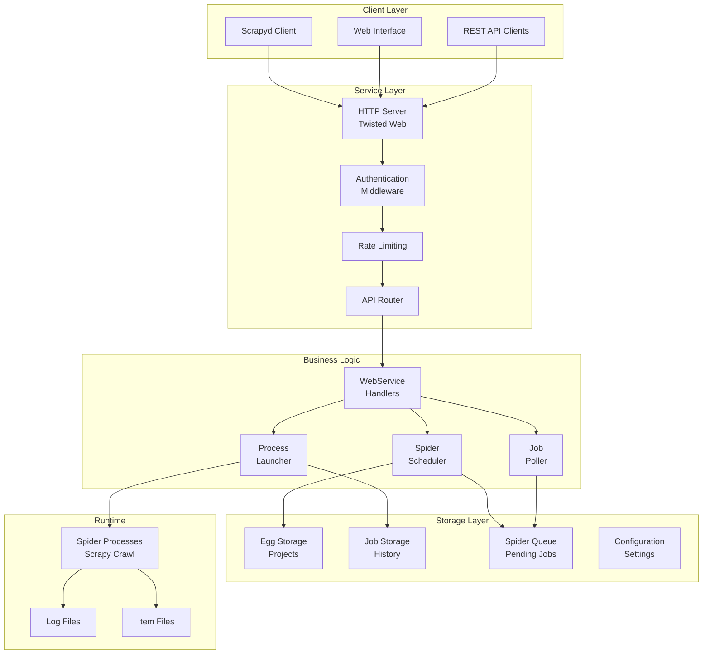

## Core Components

### 1. Web Service Layer

The web service layer handles all HTTP requests and provides both the JSON API and web interface.

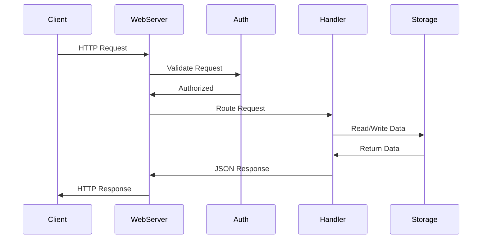

**Key Files:**
- `scrapyd/webservice.py` - API endpoint handlers
- `scrapyd/website.py` - Web interface
- `scrapyd/basicauth.py` - Authentication middleware

### 2. Job Scheduling System

The scheduling system manages the lifecycle of spider jobs from submission to completion.

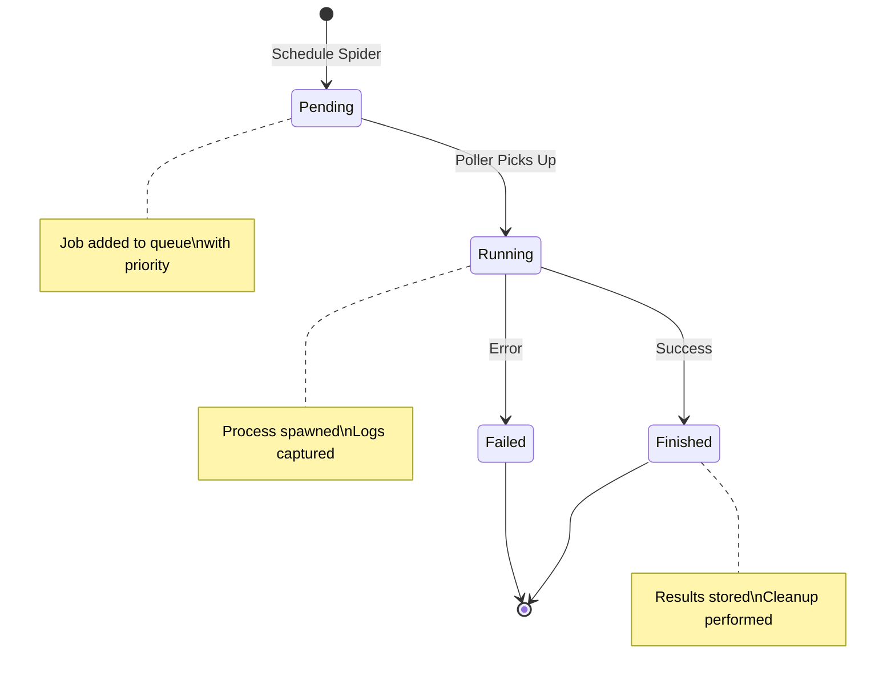

**Components:**
- **Scheduler** (`scheduler.py`) - Adds jobs to queue with priority
- **Poller** (`poller.py`) - Continuously checks for pending jobs
- **Launcher** (`launcher.py`) - Spawns and manages spider processes
- **Queue** (`spiderqueue.py`) - SQLite-backed job queue

### 3. Process Management

Scrapyd uses Twisted's process management to spawn and monitor Scrapy processes.

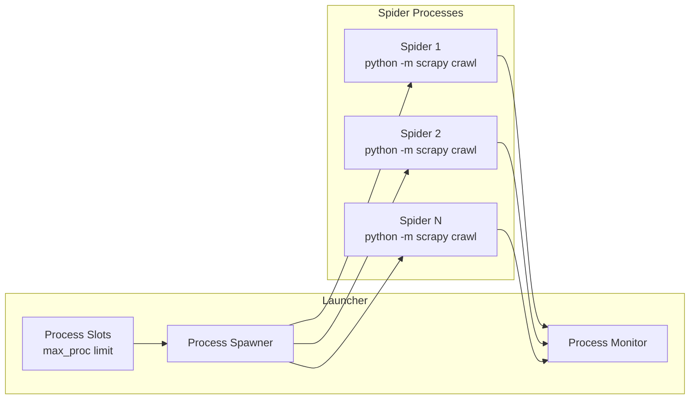

**Process Lifecycle:**
1. Job picked from queue
2. Environment prepared (PYTHONPATH, settings)
3. Process spawned with `subprocess`
4. Output captured to log files
5. Exit code monitored
6. Results stored in job storage

### 4. Storage Architecture

Scrapyd uses pluggable storage backends for different data types.

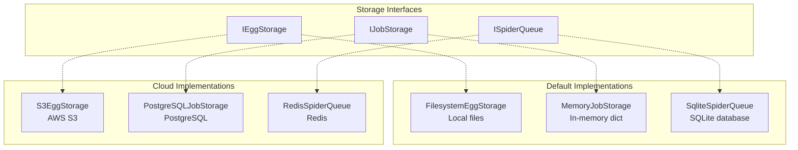

### 5. Configuration System

Configuration is loaded from multiple sources with precedence:

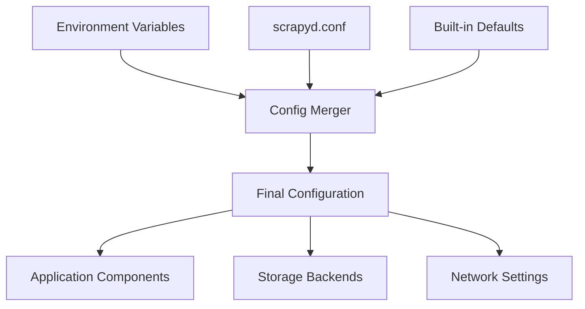

**Configuration Sources (highest to lowest precedence):**
1. Environment variables (`SCRAPYD_*`)
2. Configuration file (`scrapyd.conf`)
3. Built-in defaults

## Data Flow

### Project Deployment

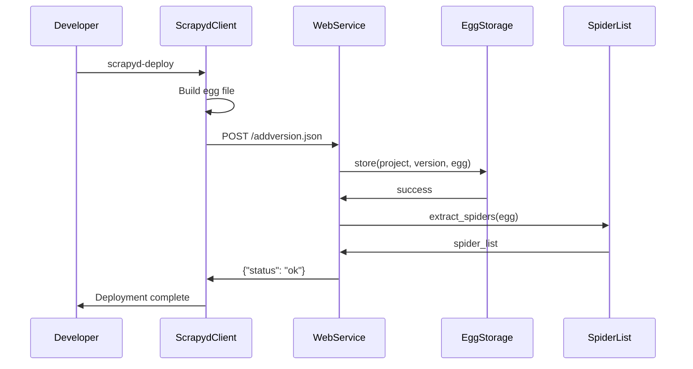

### Spider Execution

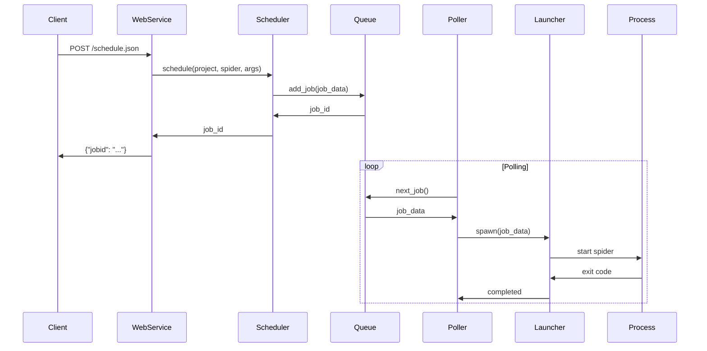

### Status Monitoring

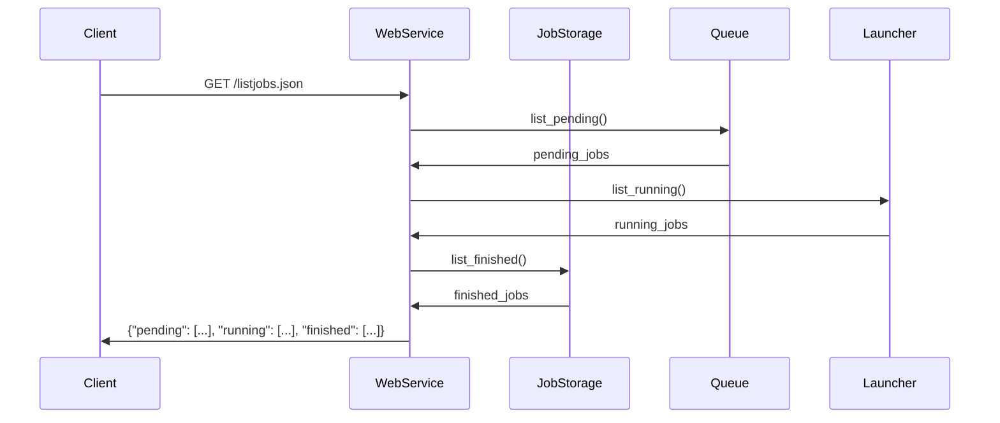

## Scalability Considerations

### Vertical Scaling

- **Increase `max_proc`** - More concurrent spider processes
- **Add memory** - Support memory-intensive spiders
- **Faster storage** - SSD for database and logs
- **CPU cores** - Better process scheduling

### Horizontal Scaling

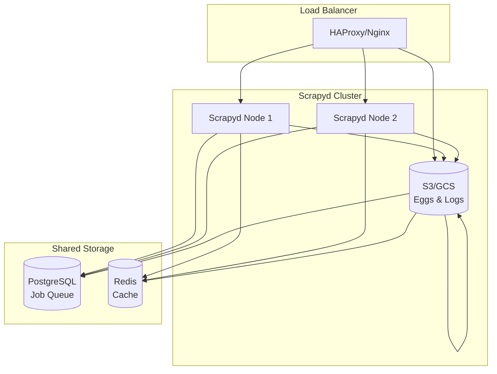

**Requirements for Horizontal Scaling:**
- Shared database for job queue
- Shared storage for eggs and logs
- Session affinity not required
- Health checks for load balancer

### Cloud-Native Deployment

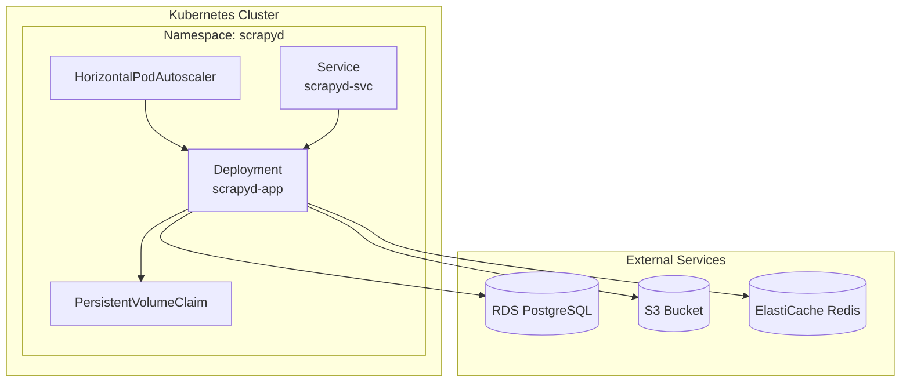

## Security Architecture

### Authentication Flow

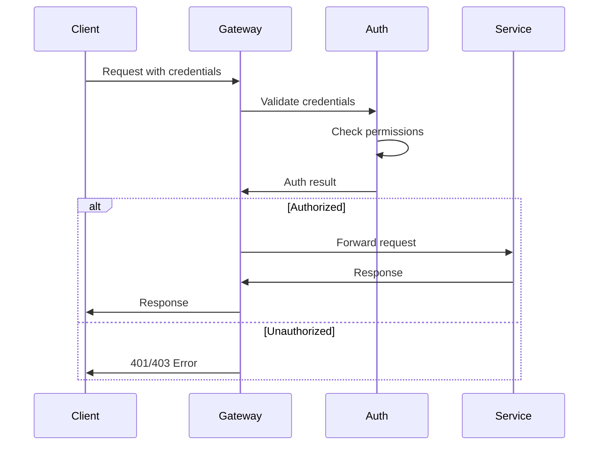

### Security Layers

1. **Network Security**
   - TLS encryption for all communication
   - VPC/firewall rules
   - Rate limiting and DDoS protection

2. **Authentication & Authorization**
   - JWT tokens or API keys
   - Role-based access control (RBAC)
   - Permission-based endpoint access

3. **Process Security**
   - Non-root user execution
   - Resource limits per spider
   - Isolated environments

4. **Data Security**
   - Encrypted storage at rest
   - Secure secret management
   - Audit logging

## Performance Characteristics

### Throughput Metrics

| Metric | Typical Value | Notes |
|--------|---------------|-------|
| API Requests/sec | 100-1000 | Depends on endpoint |
| Concurrent Spiders | 10-100 | Limited by `max_proc` |
| Job Queue Depth | 1000-10000 | SQLite or PostgreSQL |
| Spider Startup Time | 2-10 seconds | Including Python import |
| Memory per Spider | 50-500 MB | Varies by spider complexity |

### Bottlenecks

1. **Process Limits** - `max_proc` setting
2. **Memory** - Spider memory usage
3. **I/O** - Log writing, database queries
4. **Network** - Target website rate limits

### Optimization Strategies

- **Caching** - Spider lists, project metadata
- **Connection Pooling** - Database connections
- **Async I/O** - Non-blocking operations
- **Process Reuse** - Warm process pools
- **Resource Monitoring** - Alerts and auto-scaling

## Extension Points

### Custom Storage Backends

Implement storage interfaces:
- `IEggStorage` - Project storage
- `IJobStorage` - Job history
- `ISpiderScheduler` - Custom scheduling logic

### Middleware Integration

- **Authentication** - Custom auth providers
- **Monitoring** - Metrics collection
- **Logging** - Structured logging
- **Caching** - Custom cache backends

### Plugin System

```python
from scrapyd.interfaces import IPlugin

class MetricsPlugin(IPlugin):
    def on_spider_start(self, project, spider, job_id):
        # Custom logic
        pass

    def on_spider_complete(self, project, spider, job_id, success):
        # Custom logic
        pass
```

This architecture supports both small single-instance deployments and large-scale distributed systems while maintaining backward compatibility and extensibility.